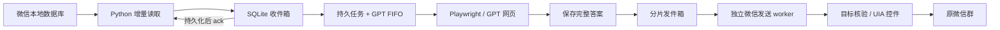

# 个人微信群 ↔ ChatGPT 网页机器人

Windows 桌面工作台支持管理监听会话、编辑人物设定与首次发送指令、保存并选用指令模板、控制本地图片/表情上传、查看运行日志和异常发送记录。支持 `/gpt`、`@ChatBOT`、`@chatbot` 及自定义别名。操作见 [桌面使用说明](docs/desktop-guide.md)。

当前版本直接从源码运行：`npm run desktop:dev`（Node.js 22+、PowerShell 7、.NET 10 SDK）。开发启动编译 TypeScript 与桌面 DLL，不制作 EXE 或便携包。本次改动与验证见 [分块风格与媒体验证](docs/style-media-validation.md)。

- 「人物与指令」可分别填写人物设定、语言风格、固定前后缀和补充要求，也可直接修改最终的首次指令全文。内置「劳大（默认）」模板，当前指令可另存为命名模板，以后选择复用。
- 每个新 GPT 对话先单独发送一次已保存的首次指令，确认不转发到微信；后续和重启后续聊不重复设置。关闭开关或全部留空时跳过初始化。
- 图片与表情上传**默认关闭**，在「运行设置」显式开启。群里先发图，再用 `@chatbot 看看这张图` 提问；关闭触发词限制时，新图片也能直接触发。动态表情转为静态首帧，读取失败保留占位。
- 已保存的网页对话会保留旧风格。修改或关闭风格后，保存、重启并在「监听会话」点击「新建 GPT 对话」应用新设置。

在 Windows 本机监听指定个人微信群，将文字发到已登录的 ChatGPT 网页，再把完整回答发回原群。保留 GPT 网页端；企业微信默认关闭，不再需要企业微信凭据。

**本机已跑通个人微信群 → GPT 网页 → 原群的完整链路，无需鼠标发送。** 微信 4.1.13.12 显式启用可访问性后，由 UIA 定位目标与输入框，核验焦点后按 Enter。两次短回复从程序收到消息到客户端提交分别约 8.35 秒、10.46 秒，数据库均仅匹配一条；测试范围和数据核验见 [验证记录](docs/validation.md)。

## 架构



读取、生成、发送分别推进。微信发送耗时时，网页可以开始下一条任务。同一 GPT 页面串行使用，各群用稳定群 ID 隔离 conversation URL；同一回答的多个片段由一个微信 worker 连续发送。

## 安装

需要 Windows 10/11、Node.js 22+、Python 3.11+、.NET 10 SDK（运行已发布桥接只需 .NET 10 Desktop Runtime），以及已由本人登录的微信与可访问 ChatGPT 的网络。

在项目文件夹运行：

```powershell
npm run setup
```

安装脚本创建 `.venv-wechatdb`，安装锁定依赖，构建原生桥接，将 Chromium 下载至 `.cache/ms-playwright`，并在本地配置不存在时复制示例；不会覆盖已有配置，也不会启动 Bot。下载、临时文件、NuGet/npm/pip 缓存均留在项目内。

编辑 `config/wechat-conversations.json`，删除示例 ID，填写真实群名。首次可省略 `id`，读取器会精确查找；存在重名则拒绝，需提供稳定 ID。发送仍依赖可区分的显示名，请为自动回复群使用唯一名称。

```json
{
  "conversations": [
    {
      "name": "我的测试群",
      "type": "group",
      "id": "实际群ID@chatroom",
      "enabled": true,
      "systemPrompt": "请用中文简洁回答。"
    }
  ]
}
```

`.env` 的默认配置：

```ini
WECOM_ENABLED=false
WECHAT_ENABLED=true
WECHAT_READ_MODE=db
WECHAT_SEND_MODE=uia
WECHAT_SEND_ACTION=enter
WECHAT_REQUIRE_PREFIX=true
WECHAT_PREFIX=/gpt
WECHAT_PREFIX_ALIASES=@ChatBOT
WECHAT_POLL_INTERVAL_MS=1000
WECHAT_SEND_INTERVAL_MS=300
```

仅监听配置中启用的会话。默认 `/gpt 问题` 或 `@ChatBOT 问题` 才触发；要回复这些群内全部文字，可设 `WECHAT_REQUIRE_PREFIX=false`。`WECHAT_ALLOWLIST` 是额外的 ID 过滤。修改配置后重启。

## 分阶段检查与运行

```powershell
npm run doctor
npm run wechat:probe
npm run wechat:inspect
```

`doctor` 检查配置、Python 依赖、浏览器文件和运行时，不读取聊天或发送消息。`probe` / `inspect` 只检查窗口；`inspect.sendCapabilities` 要有可读编辑器，使用 `invoke` 时还需要可调用的发送按钮。实际发送时仍须核验目标标题、草稿、前台窗口与编辑器焦点。

微信 4.x 如只显示 Qt 窗口外壳，先 `npm run wechat:accessibility:check`。确认需要启用后显式运行 `npm run wechat:accessibility:enable`，再 `npm run wechat:inspect`。启用工具会严格核验当前进程、DLL 哈希和唯一候选，再将内存中的可访问性标志置 1；不修改磁盘微信程序、不注入 DLL，不由 Bot 自动执行。微信重启后可能需要重做。详见 [helper](native/WeChatAccessibility/README.md)。

```powershell
npm run build
npm start
```

停止时在另一个项目终端运行 `npm run stop`。它通过项目实例专属的本地控制通道发出请求，停止接收新消息、取消在途生成、等待发送收尾并关闭浏览器和数据库。Windows 终端的 Ctrl+C 或直接关闭窗口可能强制结束进程，正式运行请使用停止命令。`npm run dev` 的文件监视仅用于开发，不用于长期驻留。

首次在程序打开的 Chromium 中人工登录 ChatGPT，后续复用 `data/browser-profile`。只有配置好真实监听会话并解决控件可用性后才启动正式自动回复。

`npm run chatgpt:smoke` **会在 GPT 网页发送 hello**；`npm run wechat:resend:task -- <任务ID>` **会实际发送微信消息**。这些命令不属于只读诊断。`WechatBOT.bat` 仍可用于构建后启动。

## 可靠性与恢复

- DB 读取只在 Node 将整批文字写入 SQLite 收件箱后确认水位。未确认批次可重放；多分片、同序号分页使用复合游标。首次订阅跳过已有历史；重启续读已确认水位之后的消息。
- 消息去重与任务创建在一个 SQLite 事务内完成。未生成的排队任务可以重启恢复；旧版本遗留、无法重建上下文的 queued 任务标记 aborted。
- GPT 回答先落盘再发送。明确尚未发送的已保存答案可在重启时恢复；生成中断、网页提交不确定时不自动再次提问。
- 每个回复片段记录 `pending / sending / sent / failed / uncertain`。`sent` 表示观察到客户端提交证据，不等于服务器或群成员已收到。重启时 `sending` 变为 `uncertain`，避免盲目重发。
- `/retry` 优先补发上次失败但已保存的答案，不重新请求 GPT；已确认片段跳过。若上次成功，`/retry` 仍表示重新生成。群内还有排队、生成或发送任务时，会提示等待。
- 桥接超时会结束该 worker，杜绝超时操作长时间留在队列中；提交边界后没有明确结果则记录未知。相同数据库的 Bot 和手动补发工具互斥。

未知发送结果需要先在微信中核对，再处理本地状态。先停止 Bot：

```powershell
npm run wechat:outbox -- list
# 已看到 task:42 的第 0 段：仅更新本地记录，不发送
npm run wechat:outbox -- mark-sent task:42 0
# 已确认该段没有发送：允许后续补发，不在此命令中发送
npm run wechat:outbox -- retry task:42 0
npm run wechat:resend:task -- 42
```

命令同样遵守前缀设置，默认在群里发送 `/gpt /new` 开始新 GPT 会话、`/gpt /stop` 停止生成并取消排队任务、`/gpt /retry` 重试、`/gpt /status` 查看状态、`/gpt /help` 查看帮助。停止生成不能撤回已交给发送 worker 的回答。群回复中的 `@昵称` 当前是普通文本提示，不是微信原生提及。

## 发送方式

`uia` 为默认：恢复并核验微信窗口、精确会话定位、标题核验、空草稿检查、输入读回、焦点核验、一次提交，再检查输入框清空。缺少控件、存在草稿或不能确认目标时停止。

`WECHAT_SEND_ACTION=enter` 与本机微信的发送键一致；若微信设置为 Ctrl+Enter，设为 `ctrl-enter`。`invoke` 只适用于实际支持按钮调用的客户端，本机实测不生效。每次只执行配置的一个动作，失败后不会尝试其他快捷键或鼠标。既有草稿默认不覆盖；冒烟工具的 `--resume-verified-draft` 仅用于人工核对未发送、内容完全一致后的诊断恢复。

`legacy` 显式保留旧视觉/坐标发送，只用于兼容性排查。它仍依赖前台焦点、OCR、剪贴板，返回未验证回执；当前发件箱会记录 `uncertain` 并停止后续片段。**它不是推荐的长期运行方式。** `ocr` 读取也只作为旧模式保留，不具备 DB 模式的水位恢复保证。

## 数据与测试

| 内容 | 项目内位置 |
| --- | --- |
| 会话、任务、收发件箱 | `data/bot.sqlite` |
| GPT 登录状态 | `data/browser-profile/` |
| 微信数据库解密缓存、密钥、水位 | `data/wechat-db-cache/` |
| Python 环境 | `.venv-wechatdb/` |
| 浏览器、安装缓存、测试临时文件 | `.cache/` |
| .NET CLI / NuGet | `.dotnet-home/`、`.nuget/` |
| 桥接发布文件 | `native/WeChatBridge/publish/` |
| 错误诊断 | `logs/`、`latest.log` |

收件箱与任务数据库包含问题、回答正文；日志默认不记录正文，诊断截图/HTML 可能包含页面内容。这些本地文件均不提交 Git。数据库与缓存尚未做自动过期清理，长期运行需要安排备份与保留策略。

```powershell
npm run check
npm test
npm run test:python
npm run build
npm run wechat:build
npm run wechat:accessibility:test
```

测试使用模拟微信、模拟浏览器和本地假数据库，不会向外发消息。架构取舍与 GitHub 资料见 [架构评估](docs/architecture-review.md)。
