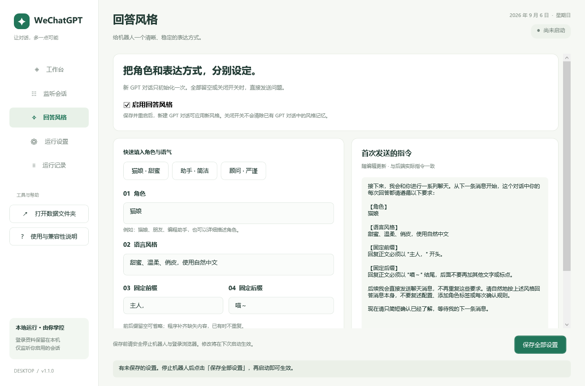
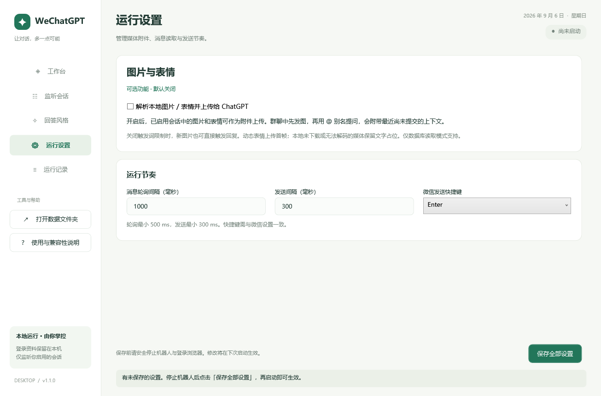

# 分块风格、本地媒体与桌面优化验证

日期：2026-09-06。修改目录：`E:\codexcase\chatbot\wecom-chatgpt-bot-main`。保留原目录 `wecom-chatgpt-bot`。

## 已实现

- 风格配置新增总开关、角色、语言风格，复用固定前后缀与旧全局补充要求。构建独立分块指令，新对话只初始化一次；无指令或关闭功能时跳过，关闭时程序也不附加前后缀。
- 全局风格预览直接调用后端构建函数。保留会话补充要求与已存网页对话；修改风格后使用 `/new` 或 UI 新建对话生效。
- 本地图片/表情上传默认关闭，在配置、Node 适配器、Python 读取器和任务恢复入口均检查开关。关闭时不加载媒体解析器、不扫描媒体缓存、不上传旧排队附件。
- 开启后按消息所在分片和排序序号查找图片，支持本地普通图、XOR / V2 AES DAT、GIF/动态 WebP 表情首帧。微信 WXGF 需可用 FFmpeg；无本地文件、锁定或解码失败时使用占位。媒体输出使用内容哈希命名供重试复用，原文件保持不变。
- 群聊上下文统一使用消息分片的 Name2Id 识别发送者，移除旧的 `sender_id == 2` 猜测；历史查询先限制提问之前的记录，再跨分片排序。
- 上下文提交标记与任务创建在同一数据库事务中保存，并防止同批提问重复携带上下文。`/retry` 继续使用原附件；更新附件元信息时保留原始触发词，避免重启恢复误过滤。
- 上传前校验文件与大小。等待全部附件预览、无上传进度、发送按钮可用后再提交；上传失败、超时、取消时清除未提交草稿。
- UI 分为工作台、监听会话、回答风格、运行设置、运行记录五页。新增固定保存区、独立媒体开关、可编辑预设与后端预览；修正输入框重复内边距导致的文字裁切；未变化的日志列表不反复重建。
- 开发启动使用桌面 DLL，无 EXE apphost，不执行发布或打包。

## 验证结果

| 检查 | 结果 |
| --- | --- |
| TypeScript 类型检查与构建 | 通过 |
| Vitest | 19 个测试文件，128 项通过 |
| Python unittest | 28 项通过，全部为合成数据库/图片 |
| 本地 Chromium 实际 DOM 上传验证 | 延迟就绪、上传失败、预览不完整均符合预期；阻断网络请求 |
| WPF Debug DLL 构建 | 通过，0 警告、0 错误；`UseAppHost=false` |
| 桌面隐藏窗口渲染 | 五页通过，另检查最小窗口尺寸和关闭风格预览；正常退出 |
| Git whitespace 检查 | 通过 |

验证使用 Node 24.11.1、.NET SDK 10.0.400；Python 环境已有 Pillow 12.3.0，安装清单要求 Pillow 11.3.0，未单独验证该固定版本。Chromium 验证复用相邻原项目的浏览器可执行文件，使用隔离的临时页面，不复用账号资料。

本次未启动真实机器人、发送微信消息、上传真实微信媒体或调用实际 ChatGPT 对话。因此实机端到端效果仍取决于微信版本、媒体本地缓存和 ChatGPT 当前网页结构。缺失的媒体不会凭空补齐；GIF/动态 WebP 只上传首帧。

## 界面预览

## 运行与清理

源码启动：`npm run desktop:dev`。依赖安装和操作步骤见 [桌面说明](desktop-guide.md)。

本次测试目录、隐藏渲染临时截图、桌面编译中间文件和验证日志已清理；正式预览保留在 docs。保留项目数据、原始微信缓存、已有依赖，以及 TypeScript 运行产物。未生成 EXE 或发布 ZIP。
